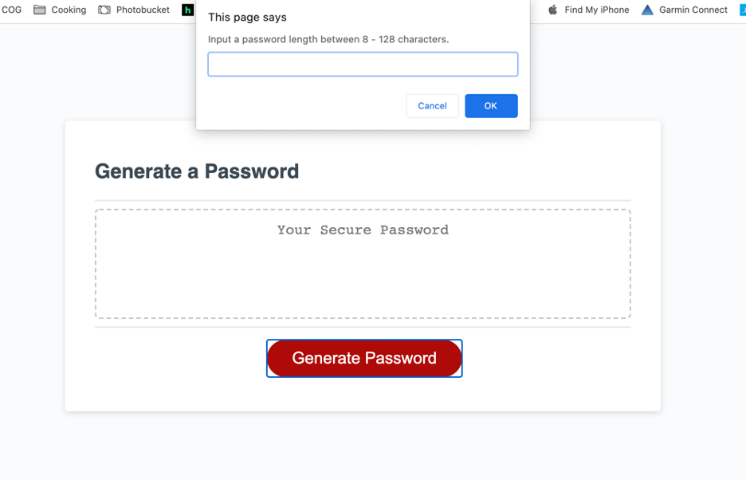
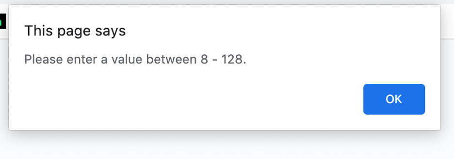
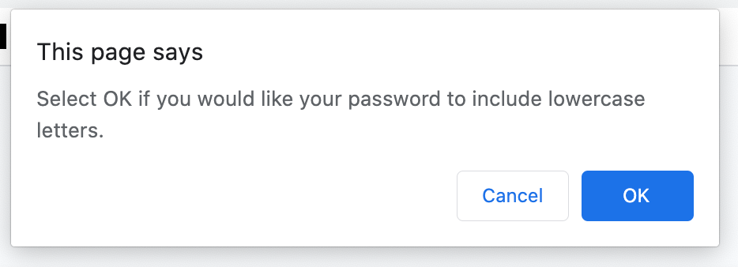
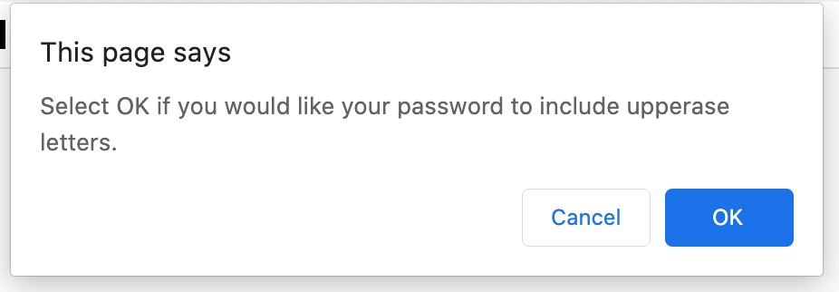
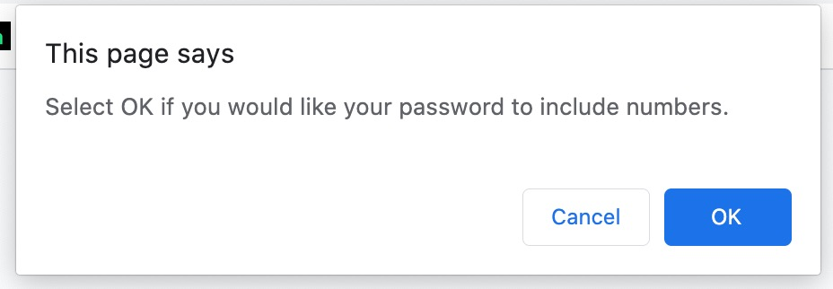
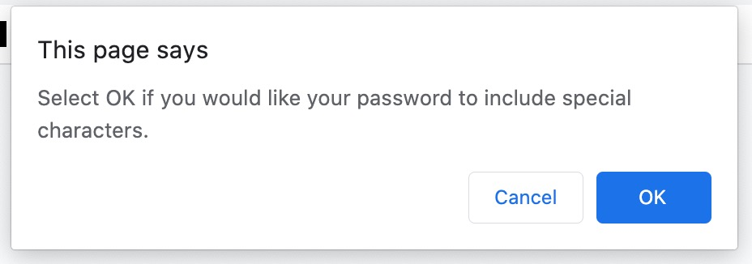
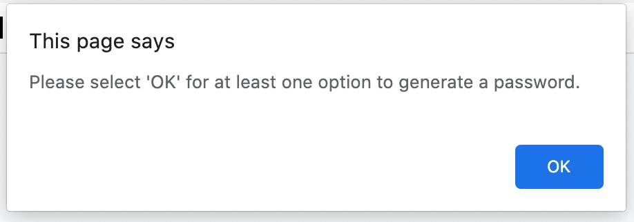

# PasswordGenerator

Create a password generator with JavaScript

Installation:

- index.html, script.js, and style.css
- Access from: https://jericfey.github.io/PasswordGenerator

Summary:

- This is a responsive web page using javascript that will allow the user to generate a random password based on their repsonses to questions for the password criteria like (numbers, letters, upper/lower-case and special characters)

Usage:

- Pushing the generate password button will prompt the user with multiple requirements that can be included in the password. This randomly selects from a pool of characters based on the users selection criteria. It also validates that a value between 8-129 is selected for password length and that at least one option was selected from upper case, lower case, special characters and numbers

Screenshots:

